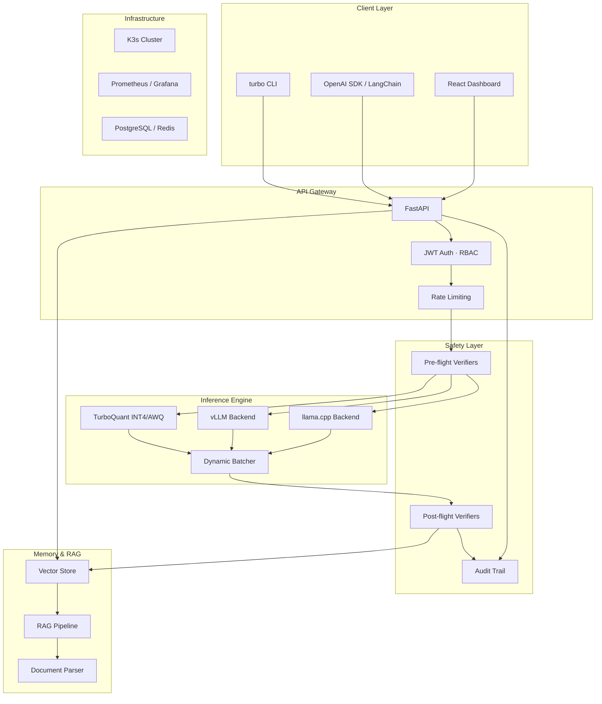

# Architecture

TurboPrivate AI is a modular, layered platform for self-hosted LLM inference with enterprise safety governance.

## System Overview

## Component Details

### API Gateway
- FastAPI with async handlers
- JWT authentication with RBAC (admin, operator, viewer)
- Request validation via Pydantic

### Safety Layer
- **Pre-flight**: Prompt injection, PII, anti-hacking detection
- **Post-flight**: Overengineering, vulnerability, patch, hallucination scoring
- **Audit**: JSONL audit trail with query and stats

### Inference Engine
- Auto hardware detection (CUDA, MPS, CPU)
- TurboQuant-v3 INT4/AWQ quantization
- vLLM and llama.cpp backends
- Dynamic batching with configurable window

### Memory & RAG
- In-memory vector store with cosine similarity
- Multi-format document parser (PDF, DOCX, HTML, CSV, JSON, XML, YAML, MD)
- Configurable chunking and embedding

### Infrastructure
- K3s provisioning via SSH or Terraform
- Helm chart deployment
- Age-encrypted backups
- Prometheus + Grafana monitoring

## Data Flow

1. Request arrives at API Gateway via CLI, SDK, or Dashboard
2. Authentication and rate limiting applied
3. Pre-flight safety verifiers scan the input
4. Request routed to Inference Engine (direct or via Gateway proxy)
5. Dynamic batcher groups requests for optimal throughput
6. Post-flight safety verifiers scan the response
7. Audit trail records the full transaction
8. Response returned to client
